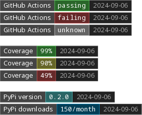

# Enasis Network Badge Creator

## Build virtual environment
```shell
python -m venv venv
source venv/bin/activate
pip install weasyprint wand
```

## Run the prototype script
Update [badges.py](badges.py) to your liking and start.
```
python -m badges.badges
```
You should now have an [badges.png](badges.png) file!

> 

Create one more specific to your desired outcome.
```
python -m badges.single green "GitHub Sphinx" passing
```
You should now have an [single.png](single.png) file!

> 
