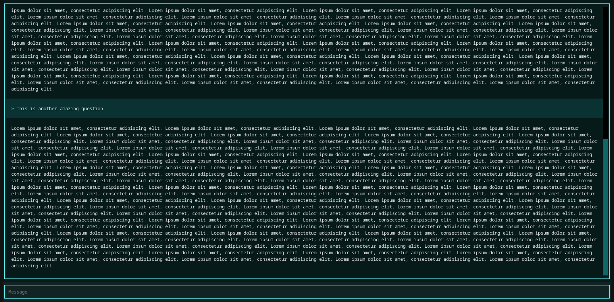

# Enasis Network Textual Chatting

## Build virtual environment
```shell
python -m venv venv
source venv/bin/activate
pip install textual
```

## Run the prototype script
Update [chatcli.py](chatcli.py) to your liking and start.
```
python -m chatcli.chatcli
```
The interface should take over your current console!

> 
