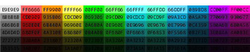

# Enasis Network Palette Generator

## Build virtual environment
```shell
python -m venv venv
source venv/bin/activate
pip install encommon weasyprint wand
```

## Run the prototype script
Update [palette.py](palette.py) to your liking and start.
```
python -m palette.palette
```
You should now have an [palette.png](palette.png) file!

> 
